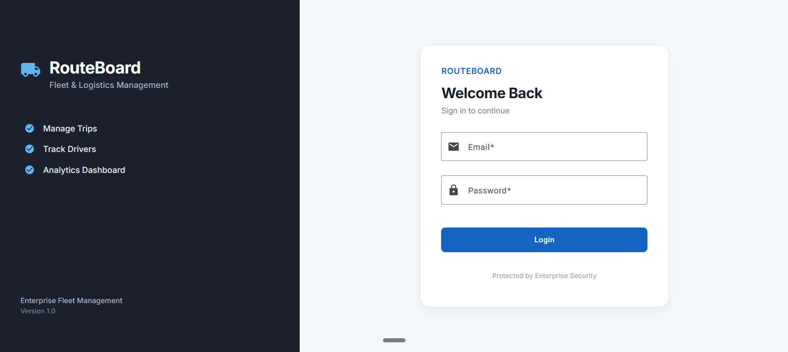
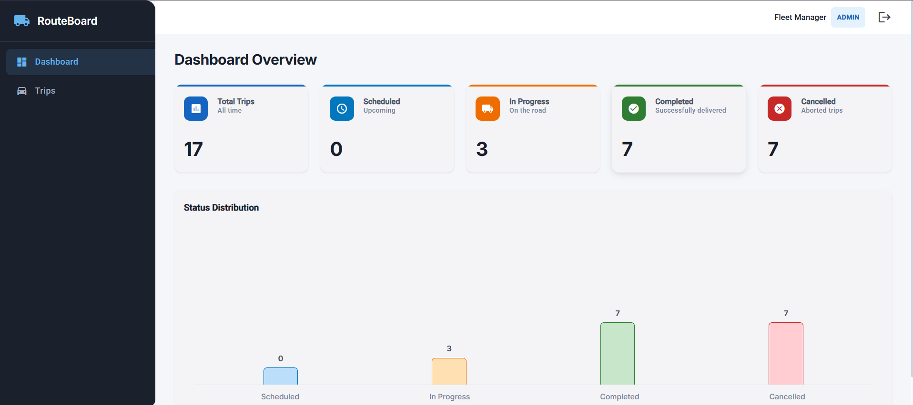
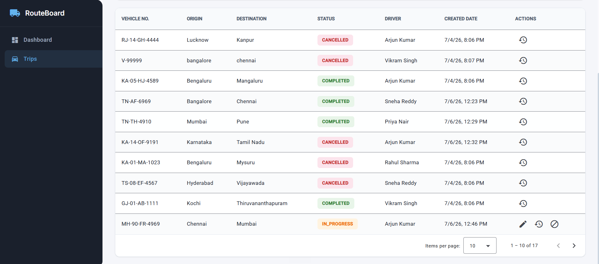
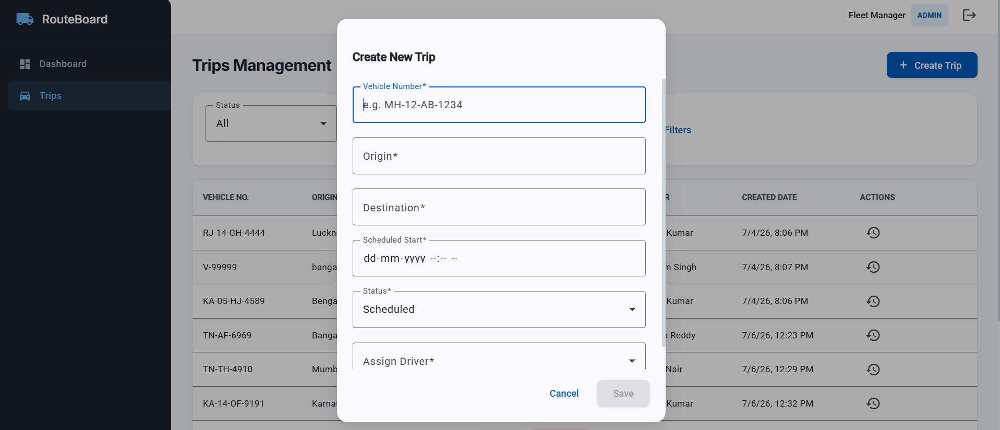
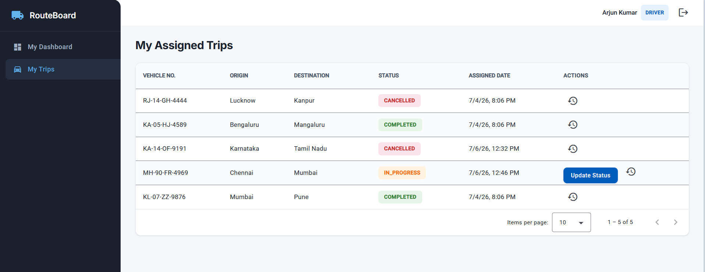
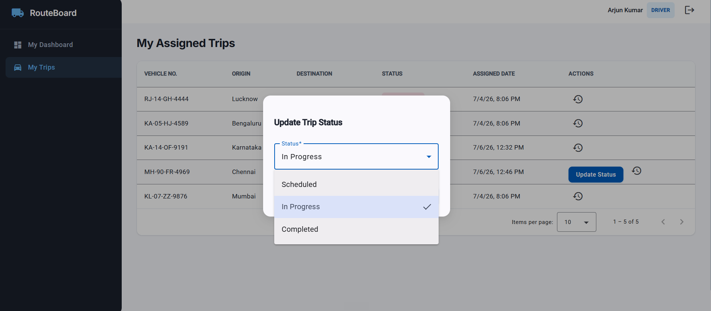

# RouteBoard

A full-stack Fleet and Logistics Management System built using Angular, NestJS, PostgreSQL, and TypeORM. The application provides secure role-based authentication and enables administrators to manage trips while allowing drivers to update the status of their assigned trips.

---

## Live Demo

**Frontend (Vercel)**  
https://frontend-three-snowy-32.vercel.app

**Backend API (Render)**  
https://routeboard.onrender.com

---

## GitHub Repository

https://github.com/Mrithyunjay02/RouteBoard

---

## Features

### Authentication
- JWT-based authentication
- Role-based authorization (Admin & Driver)
- Secure login
- Protected routes

### Admin
- Dashboard with trip statistics
- Create new trips
- Edit existing trips
- Cancel trips
- Assign drivers
- Filter trips
- View trip history
- Status distribution analytics

### Driver
- View assigned trips
- Update trip status
- View trip history
- Dashboard showing assigned trip statistics

### Business Rules
- Admin can create, edit, assign, schedule and cancel trips.
- Drivers can update their assigned trips from Scheduled → In Progress → Completed.
- Trip status changes are reflected immediately across both Admin and Driver dashboards.

---

## Tech Stack

### Frontend
- Angular
- Angular Material
- TypeScript
- Chart.js

### Backend
- NestJS
- TypeORM
- JWT Authentication
- PostgreSQL

### Database
- PostgreSQL (Supabase)

### Deployment
- Frontend: Vercel
- Backend: Render

---

## Architecture

```
Angular Frontend
        │
        │ REST API
        ▼
NestJS Backend
        │
        ▼
PostgreSQL Database
```

---

## Project Structure

```
RouteBoard
│
├── frontend
│   ├── Angular Application
│   └── Angular Material UI
│
├── backend
│   ├── NestJS REST API
│   ├── Authentication
│   ├── Trips Module
│   ├── Users Module
│   └── PostgreSQL
│
└── screenshots
```

---

## Demo Credentials

### Admin Account

| Email | Password |
|--------|----------|
| admin@test.com | password123 |

### Driver Accounts

| Email | Password |
|--------|----------|
| driver@test.com | password123 |
| driver2@test.com | password123 |
| driver3@test.com | password123 |
| driver4@test.com | password123 |
| driver5@test.com | password123 |

> These accounts are provided for demonstration and evaluation purposes.

---

## Screenshots

### Login



---

### Admin Dashboard



---

### Trips Management



---

### Create New Trip



---

### Driver Dashboard



---

### Driver Status Update



---

## Running Locally

### Clone Repository

```bash
git clone https://github.com/Mrithyunjay02/RouteBoard.git
cd RouteBoard
```

### Backend

```bash
cd backend
npm install
npm run start:dev
```

### Frontend

```bash
cd frontend
npm install
ng serve
```

---

## Environment Variables

### Backend (.env)

```
DATABASE_URL=
JWT_SECRET=
JWT_EXPIRES_IN=
PORT=
```

### Frontend

Update the API URL inside the Angular environment configuration if running locally.

---

## Future Improvements

- Email notifications
- Real-time trip tracking
- Driver location integration
- Route optimization
- File upload support
- Dashboard analytics enhancements
- Unit and integration testing

---

## Author

**D K Mrithyunjay**

GitHub: https://github.com/Mrithyunjay02

LinkedIn: *(Add your LinkedIn profile here if you'd like.)*

---

## License

This project was developed as part of a technical assessment and is intended for educational and portfolio purposes.
